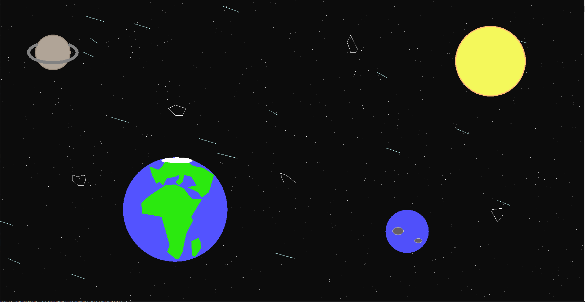

All graphical functions used a special structure, window context. It stores current parameters of the area in which we draw.
The context is stored in a variable of HDC (Handle to Device Context) type

Graphics in the console is visible when drawing is performed in a visible window. 
When the console window is minimized or overlapped, the graphics disappear. 
In fact, Windows applications receive a message from the OS that they should redraw their window (or part of it) and the 
programmers place calls to graphics functions in the handler of this message (a special function). 

After minimizing or overlapping the console window, the drawing must be repeated. 
must be repeated. For this purpose, the program created the draw(.) function, which can be called with the "p" key

​

